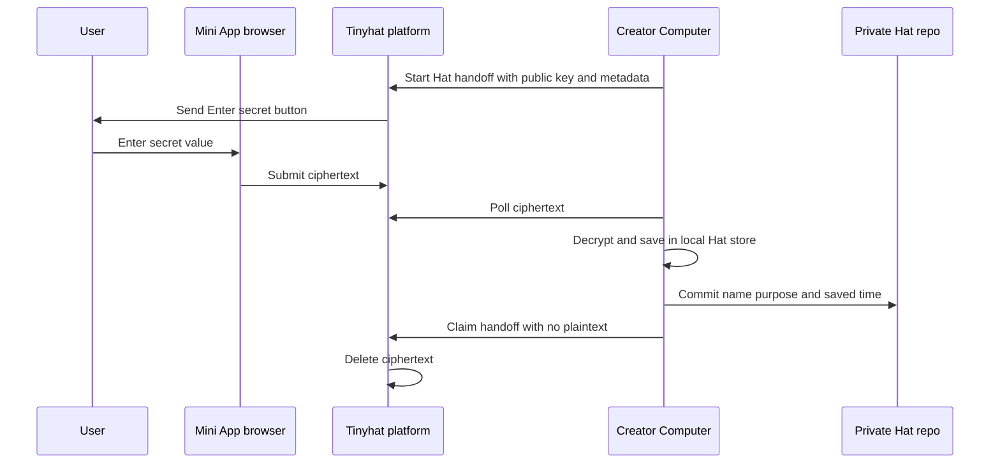

# Architecture

Tinyhat has two public layers on a managed Computer:

1. **Runtime**: small infrastructure code that keeps the Computer
   connected to the Tinyhat platform.
2. **Plugin**: agent-facing skills and tools that teach the framework how
   to use Tinyhat capabilities.

This repository is the plugin layer.

## Current v0.20 Shape

```text
tinyhat/
|-- plugin.yaml
|-- hermes.plugin.json
|-- __init__.py
|-- schemas.py
|-- tools.py
|-- skills/
|   |-- tinyhat-plugin-version/
|   |   `-- SKILL.md
|   `-- tinyhat-tell-joke/
|       `-- SKILL.md
`-- docs/
```

The first branch supports Hermes only. Its proof skills are deliberately
small: one reports the plugin version Hermes has actually loaded, and one
tells a deterministic joke. If an agent can call them from chat, we know
the Computer installed the plugin and Hermes loaded it.

## Boundary

The plugin can explain and use Tinyhat capabilities, but it should not
become the platform or the runtime.

| Layer | Owns |
| --- | --- |
| Tinyhat platform | Auth, authorization, users, agents, Computers, invitations, and APIs. |
| Tinyhat runtime | Heartbeat, attestation, runtime commands, framework install, plugin install/update. |
| Tinyhat plugin | Public skills, small adapter tools, and safe agent instructions. |

Future skills will call named platform capabilities through the
Computer's attested identity. They should not paste raw backend URLs or
ask users for secrets in chat.

## Secret Handoff Pattern

The plugin can start a private secret handoff without expanding the
runtime. The platform exposes a versioned handoff API. The Computer calls
that API with its attested identity, the plugin skill gives the user a
Telegram Mini App button, and the browser encrypts the secret value before
it reaches Tinyhat.

This pattern keeps responsibilities narrow:

- the platform owns authorization and stores short-lived ciphertext;
- the plugin owns the agent-facing instruction and tool;
- the runtime stays focused on identity, heartbeat, and installation.

This diagram shows how Hat secret plaintext reaches only the local Computer
store while the platform and private repo remain value-blind.



Hat repo editing follows the same boundary. The model supplies a relative path
and non-secret text to `tinyhat_hats`; the authenticated platform resolves the
owner and repo, validates the path, and creates a normal commit. The tool has
no branch deletion, force-push, history rewrite, or whole-repo deletion action.
