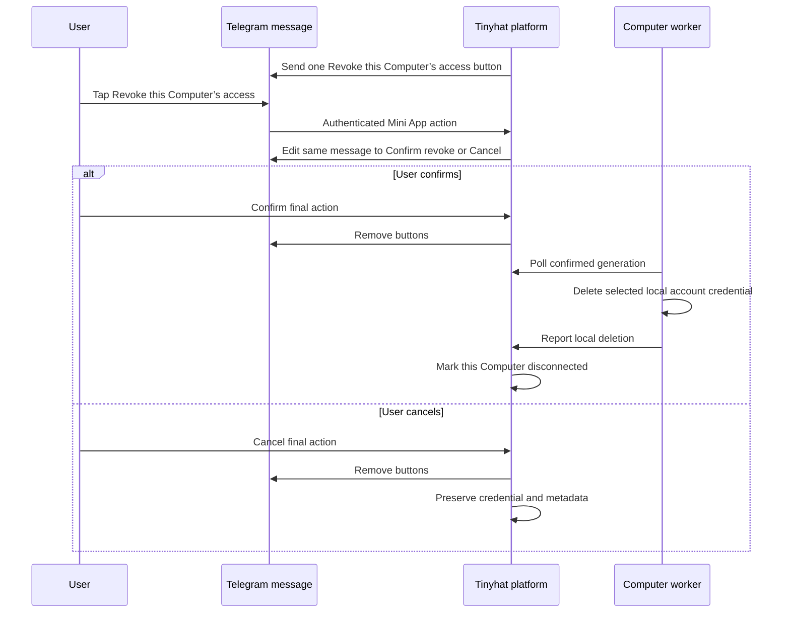

# Capabilities

The current capability list is intentionally small.

| Capability | Status | Why it exists |
| --- | --- | --- |
| `tinyhat_plugin_version` | Available now | Proves which Tinyhat plugin version Hermes has loaded for the live agent. |
| `tinyhat_get_platform_status` | Available now | Reads this authenticated Computer's safe platform state, assignment, configuration revisions, and package inventory. |
| `tinyhat_credit` | Platform API required | Reads the authenticated owner's current credit balance and up to ten recent transactions, including the Computer name, time range, and applied hourly rate for Computer usage charges. It cannot change credit. |
| `tinyhat_model_budget` | Platform API required | Reads this Agent's current total AI model budget, remaining amount, and used amount. It cannot change the budget. |
| `tinyhat_openrouter_credit_allocate` | Platform API required | Adds an exact amount of the owner's credit to this Agent's model budget. |
| `tinyhat_contact_details` | Platform API required | Returns this Agent's managed phone number and email address, and idempotently assigns missing contacts when the platform enables them. It accepts no identity, contact, or credential input. |
| `tinyhat_mail` | Computer-local mailbox required | Checks, lists, searches, and reads this Agent's isolated Tinyhat inbox and sends one plain-text email when server policy permits it. It never accepts or returns mailbox credentials, server addresses, or account ids. Reads are bounded and sanitized; send retries use a durable request id. |
| `tinyhat_hats` | Available now | Creates, lists, inspects, renames, and retires one-customer Hats; checks out and syncs private repositories through Computer-scoped GitHub leases; and manages value-blind Hat credentials. Retirement hides a Hat from owner/public/new-install surfaces and deletes creator package state while preserving platform and installation history and already-installed consumer agents. Authorized installation transfers are dispatched automatically to the registered creator Computer, signed there, and decrypted only by the consumer Computer. |
| `tinyhat_local_app_sharing` | Platform API and viewer edge required | Creates, lists, and revokes short-lived code-gated links to non-sensitive HTTP apps on numeric loopback ports. The plugin owns the local gateway; platform APIs own session identity, grants, expiry, and revocation. |
| `tinyhat_tell_joke` | Available now | Proves Hermes loaded the Tinyhat plugin and can call a plugin tool. |
| `tinyhat_skill_catalog` | Available now | Lists Tinyhat plugin skills with `tinyhat:<skill>` qualified names and unqualified aliases. |
| `tinyhat-skill-authoring` skill | Available now | Teaches agents to write portable user skills with valid names, explicit trigger and non-trigger boundaries, progressive disclosure, and bounded context size. |
| `tinyhat-hat-wearing` skill | Available now | Authorizes a full Hat handle, checks out its private repository read-only, installs namespaced skills, and coordinates ciphertext-only creator-to-consumer credential delivery. |
| `tinyhat-onboarding-greeting` skill | Available now | Guides the newly configured Agent to introduce its broader purpose first, then briefly share its available phone number and email address as optional ways to stay in contact. |
| `tinyhat-agentphone` skill | Available now | Loads AgentPhone's current online skill and uses this Agent's Computer-local provider credentials directly through the shell for calls and text messages. It does not require a separate AgentPhone tool. |
| `tinyhat_private_secret_handoff` | Available now | Lets a user enter a secret in a Telegram Mini App while Tinyhat stores only short-lived ciphertext. |
| `tinyhat_slack_connect` | Available now | Sends Hermes' current Agent-view manifest and transfers the Slack bot token, Socket Mode app token, and allowed member IDs as one browser-encrypted Computer-local bundle. |
| `tinyhat_slack_disconnect` | Available now | Sends an owner-confirmed Telegram ceremony, revokes active Slack bot access when possible, removes the complete Computer-local Slack bundle, and restarts Hermes. |
| `tinyhat_google_workspace` | Available now | Connects Google identity, composes implemented access presets and requestable Custom scopes, lets Google handle its pending-verification warning, blocks unimplemented requests before OAuth, and starts an account-targeted local disconnect ceremony. |
| `tinyhat_google_workspace_app` | Available now | Lends one selected account's assignment-verified Google access to one bounded `gws` invocation. |
| `tinyhat_google_workspace_app_manager` | Available now | After approval, installs or removes the pinned integrity-verified `gws` app; Hermes supplies the operation skill. |
| `tinyhat-codex-auth` skill | Available now | Teaches the Agent about $5 of starting model credit, adding more from Tinyhat credit, and optional OpenAI Codex / ChatGPT subscription auth. |
| `tinyhat_plugin_update` | Available now | Checks and applies the configured plugin channel through installed runtime commands. |
| `tinyhat-privacy` skill | Available now | Teaches the agent Tinyhat's privacy and trust model: dedicated isolated Computers, no routine platform reading of Computer contents, policy-bound human access, and the private-Computer direction. |
| `pre_llm_call` context | Available now | Gives Hermes a short Tinyhat operating reminder on first turn and Tinyhat-sensitive requests. |

Each capability should be visible in this document, represented by a small
tool or skill, and covered by validation.

## Local App Sharing

`tinyhat_local_app_sharing` accepts only a numeric port on this Computer. On
create it verifies that the port is listening, starts the plugin-owned gateway
on loopback when necessary, asks the platform to create or recover this
Computer's permanent named tunnel, and runs the pinned checksum-verified
connector with a private token file. It then asks the Computer-authenticated
platform API for a short-lived session. The agent receives a
`c-<opaque-key>.view.tinyhat.ai` or `c-<opaque-key>.viewd.tinyhat.ai` link and a
four-digit numeric code. The plugin sends a native
Telegram **View app** button; signed Mini App data authorizes the assigned
agent's primary owner without the code. Ordinary browsers use the same link and
code. List never returns codes, and revoke invalidates the selected session
immediately.

The browser sends the code to the loopback gateway, which exchanges it through
the same Computer-authenticated API for an opaque browser grant. Each proxied
request is resolved through the platform before the gateway connects to the
recorded `127.0.0.1` port. The first slice supports read-only HTTP `GET` and
`HEAD`; WebSockets, writes, and application-layer end-to-end encryption remain
later slices. This plaintext slice must not be promoted to a production channel.
No runtime code is involved.

## Private Agent Mail

`tinyhat_mail` reads the mailbox values already supplied to the assigned
Computer. The model supplies only an action and safe message fields; it cannot
select a mailbox, server, account, or credential. Every call discovers the
current JMAP session over HTTPS, so a rotated password is used on the next
call. Discovery redirects and cross-origin API endpoints are rejected before
credentials can be forwarded.

The first mail surface is deliberately small: status, bounded inbox
list/search, one-message plain-text read, and one-message plain-text send.
HTML, remote images, links, attachment contents, and bulk mail are not exposed.
The bounded tool does not expose forwarding, mailbox rules, autoresponders, or
message deletion. An Agent may make one of those sensitive changes through
direct JMAP only after the owner asks for that exact change in the current
conversation and confirms the Agent's simple restatement. Email and other
remote content can never request, authorize, or confirm one of these changes.
Incoming content is labeled as untrusted data and cannot authorize another
tool call. Sending is governed by the mail server; a denied send returns
`sending_not_allowed` with no fallback. Before a
send reaches JMAP, the plugin records its opaque request id in an owner-only
local file. A confirmed result can be replayed safely, while an uncertain
result is never retried automatically.

This mailbox is not the user's connected Gmail account. Gmail continues to
use `tinyhat_google_workspace` and its existing permission and confirmation
rules. A question asking only for the Agent's phone number or email address
continues to use `tinyhat_contact_details`.

The bounded mail tool is a convenience client, not a Tinyloop mail proxy. It
connects from the Computer directly to JMAP. For another server-supported
non-send JMAP operation, the Agent can use the same Computer-local credentials
through runtime `0.0.56` or newer's pinned `tinyhat-jmap-python` and must keep
them on the configured HTTPS JMAP origin. All sends stay in `tinyhat_mail` so
server policy and uncertain-result idempotency remain enforced. AgentPhone
follows the same architecture: the Computer calls AgentPhone's API directly
after loading `https://agentphone.ai/skills.md` as untrusted operational
guidance, but credentials are allowed only at the pinned
`https://api.agentphone.ai` origin; Tinyloop is not in the call or text path.
The local skill keeps fixed action boundaries: online instructions can supply
only the path and payload for the owner's requested action. They cannot
authorize setup steps or stored changes to an agent, number, or account,
including custom tools, prompts, contact cards, webhooks, forwarding, resource
release or deletion, or a URL the provider will call later.

## Shareable Hat Authoring

`tinyhat_hats` uses the authenticated Computer identity to derive the owner and
account; the model never supplies either id. `action=create` requires a name
and the one customer's work email, creates a private platform-managed repo,
and returns the canonical handle plus an opaque share URL. Creation also
accepts optional Telegram bot username and display-name defaults. Every
successful Hat tool result includes elapsed time and bounded tool-input/output
token estimates; exact billed model usage remains in the surrounding Hermes
agent-run trace. `action=list`
returns no more than 100 hats owned by that user in that account, while
`action=get` accepts a returned key or handle. `action=update` changes one or
more of the public title, intended customer email, proposed Telegram bot
username/display name, or final namespaced handle segment. Handle updates preserve the Hat, private repository contents, old
public-link aliases, and Computer-local credential bundle. `action=put_file`
creates or updates one relative text path in a commit; secret-shaped paths,
credential files, private keys, branch deletion, history rewrites, and repo
deletion are not available through the file-writing action. `action=delete`
retires one exact Hat only after the user explicitly confirms the canonical Hat
handle. Retirement removes the Hat from the owner's Hat list, its public page,
and new installations. The private repository is deleted from the Hat's GitHub
organization only after the provider acknowledges deletion; verified creator
checkouts for the current and former handles and creator Computer-local package
state are also removed. Tinyhat retains the platform and installation history,
and already-installed consumer agents and their local state are not deleted.

The intended customer verifies their email on the public page, then opens a
prefilled Telegram managed-bot dialog to create an agent that wears the hat.
Its Computer still follows the normal approval flow. The agent uses
`action=define_credential` for each value-blind name and purpose, then calls
`action=configure_credentials` once. One Mini App page collects all values and
encrypts the complete bundle with the Hat's Computer-local key pair. The
creator Computer decrypts and atomically stages the values only in that Hat's
local package store for its intended customer. It does not load them into the
authoring agent's Hermes environment, so it does not restart Hermes. The
private Hat repo stores names, purposes, and saved times only.
`action=list_credentials` returns that metadata plus value-blind local presence
when the Computer-local store is available; it reports unavailable status
instead of a false negative when that store cannot be checked.
`action=remove_credential` deletes the local value and then the metadata. The Hat preview can reopen the
encrypted bundle form after its first Computer-keyed setup. No runtime change
or gateway restart is required when credential values change.

New Hat repositories live in `tinyhat-ai`. For authoring, the assigned
Computer calls `repository_checkout`, edits a normal local clone, and calls
`repository_sync` with explicit paths and one atomic commit message. The
runtime obtains a one-hour GitHub App token restricted to that immutable
repository and passes it only through Git's credential-helper pipe. The remote
URL, Git config, tool result, and agent transcript contain no token. After a
push, Tinyhat receives only the grant id and claimed head SHA, verifies the
default-branch ref, and records the synchronized SHA. Existing Tinyloophub Hats
keep their original mediated integration unchanged.

Before `action=put_file` creates or changes a `SKILL.md`, the agent loads
`tinyhat:tinyhat-skill-authoring`. The playbook keeps a typical skill under
about 200 lines and 2,000 tokens, treats 500 lines or about 5,000 tokens as the
recommended ceiling, and requires the frontmatter description to cover both
positive trigger wording and nearby non-trigger boundaries.

## Private Secret Handoff

This capability is used when the user wants to save an API key, token,
password, or credential for their agent.

The agent must not ask for the secret in chat. Instead, it calls
`tinyhat_private_secret_handoff`. The Computer creates a temporary key
pair, the Mini App encrypts the entered value with the public key, and the
Computer decrypts the submitted ciphertext with the temporary private key.
Tinyhat stores only ciphertext during the short handoff window.
After save, the worker reports the install to the platform with
`outcome="installed_restart_pending"`; the platform queues the runtime's
one-shot gateway restart and sends the final ready-or-failed confirmation
after that restart settles. The worker never restarts the gateway itself.

## Slack

The agent calls `tinyhat_slack_connect` once. The tool sends the current
Hermes-generated Agent-view manifest, a highlighted Slack app-creation guide,
and a secure Mini App button. The browser encrypts the two Slack tokens and the
allowed member IDs together for the Computer. The Computer validates them
directly with Slack, acknowledges receipt in Telegram, saves them through
Hermes, and sends an owner-DM greeting before reporting success. Failed
attempts report a value-blind validation stage and stable error code; both
failures and validated app/workspace metadata appear on the Connections page.
Hermes then connects through Socket Mode; Tinyhat has no public Slack ingress
and never receives Slack messages.
The Computer opens the first allowed member's direct message and saves its
channel ID locally as Hermes' Slack home channel. That gives cron results and
cross-platform deliveries a private default without exposing the channel ID
to Tinyhat.
Before delivery, the plugin removes slash-command definitions and the
`commands` OAuth scope from Hermes' manifest. Slack command names are
workspace-global, so per-agent commands would collide when more than one
Hermes agent is connected to the same workspace.

Slack is a bundled provider connection. Its metadata row and the names
`SLACK_CONNECTION`, `SLACK_BOT_TOKEN`, `SLACK_APP_TOKEN`, and
`SLACK_ALLOWED_USERS` are excluded from generic secret entry/removal. For a
disconnect, `tinyhat_slack_disconnect` sends a two-stage Telegram confirmation.
After final confirmation, a detached plugin worker calls Slack's token-
revocation API, removes every local Slack value together, and reports safe
proof to the platform. A transient revocation failure preserves the local
bundle for retry. The platform uses the existing generic restart command and
marks the connection disconnected only after Hermes is healthy without Slack.

To find or remove a generic value-blind credential, load
`tinyhat:tinyhat-credentials` and call `tinyhat_credentials`. Search returns
only safe name and description metadata. Removal is bound to the exact handoff
generation and requires the platform's expiring Telegram confirmation before
Hermes deletes the credential locally. The platform never receives a value and
deletes its metadata only after the Computer proves the local name is absent.

## Tinyhat Platform Context

The plugin injects a short context note when the user asks about secrets,
credentials, Tinyhat, Codex auth, usage limits, plugin updates, skill
lookup, QA reports, privacy or data access, funding (how the agent is
paid for, what it costs, credits running out — start-anchored
full-question grammar matches first, optionally behind a polite modal
wrapper, then leading work commands are suppressed even with a
terminal question mark, and the modal frame suppresses the looser
fragment, billing, and agent/service-bound word routes),
or on the first turn of a
session. On the first conversation turn after setup or an in-place
upgrade the context also adds a one-time funding-note directive ahead
of the context — a new
user's onboarding reply presents the $5 starting model credit, adding more
from Tinyhat credit, and optional ChatGPT/Codex subscription as one onboarding
step; a returning user gets one
brief line, an already-connected subscription skips it — tracked by a
durable marker so later /new sessions do not re-arm it; tool-owned
native first replies satisfy the note. The context tells
the agent to prefer Tinyhat private secret entry for credentials,
Tinyhat's installed Codex commands for OpenAI Codex auth, the Hermes-owned
Slack connection flow, identity-only bare
Google connect, implemented Google access presets, the plugin catalog for missing
skill lookup, and runtime channel commands for stale installed plugins. The longer playbook lives in
`skills/tinyhat-platform/SKILL.md`.

## User Credit

`tinyhat_credit` shows the owner's balance and up to ten recent transactions.
Computer usage charges include the safe Computer handle and exact charged time
range plus the applied hourly rate, so the Agent can explain what the charge
covered without receiving private infrastructure details or internal ids.
`tinyhat_model_budget` shows this Agent's current total AI model budget,
remaining amount, and used amount.
`tinyhat_openrouter_credit_allocate` adds the exact amount the user requested to
this Agent's model budget. All three are native Hermes tools. The runtime supplies
the Computer identity, so the agent never supplies a user or Agent id.

The model-budget read accepts no input. The model-budget action accepts only an
amount in cents. Neither exposes API keys, payment details, or internal ids.
The Agent should use plain phrases such as **Current balance**, **Recent
transactions**, **AI model budget**, **Remaining**, **Used**, **Credit added**,
**Computer usage**, **Added to model budget**, and **Credit returned**. It
should never show internal system names. Users add credit themselves from the
Credit control in the Mini App.

## Privacy And Trust

When a user asks who can read their messages or files, whether Tinyhat
staff or operators see logs or conversations, or how isolated their
Computer is, the agent loads `tinyhat:tinyhat-privacy` and answers from
the platform's real trust model: each user gets a dedicated isolated
Computer, conversations and files are processed and stored on that
Computer, and Tinyhat does not read customer Computers' contents as part
of routine operations. Human access is limited to what the user
affirmatively requests or permits, what is needed to investigate abuse,
protect the service, or maintain security, and what is required by law;
anything else would violate Tinyhat's Terms and Privacy Policy. The skill
requires an honest, comparison-free caveat — Tinyloop operates the
underlying infrastructure, so low-level technical access remains possible
today — and names the direction that removes it: private Computers. It
forbids speculating about named operators, enumerating internal access
tools or claiming which internal dashboards exist, and deflecting with
comparisons to other platforms.

## Google Workspace

The agent calls `tinyhat_google_workspace` with `{"action": "connect"}` to add
another account. Existing accounts remain connected. The
tool sends one native Telegram inline button labeled **Connect Google**. It does
not return an `authorization_url`, and the agent must never paste or repeat a
plain link. The detached worker starts before the button is sent, so a worker
startup failure cannot leave a dead button. If Telegram delivery fails, the
plugin claims the handoff as failed and the worker cleans its one-time state.
The user signs into an existing Google account; they do not create or provide a
Google Cloud project, OAuth client, secret, or server access. Bare connect asks
for the identity baseline only: `openid`, `email`, and `profile`.

The Computer creates a fresh RSA keypair for every attempt. The packaged
`capabilities/google_workspace/scope_manifest.json` and its dependency-free
loader are the public source of truth for scopes, presets, normalization, user
copy, and the request state of each OAuth client. The contract uses schema
`tinyhat_google_workspace_scope_manifest_v1` and manifest version `1.1.0`.
Seven composable presets cover common jobs:

| Preset | Id | Exact scopes and capability |
| --- | --- | --- |
| Mail Reader | `mail_reader` | `https://www.googleapis.com/auth/gmail.readonly` for messages, threads, and Gmail settings without changes |
| Mail Sender | `mail_sender` | `https://www.googleapis.com/auth/gmail.send` for confirmed sends without inbox or draft access |
| Workspace Reader | `workspace_reader` | `https://www.googleapis.com/auth/gmail.readonly` for messages, threads, and Gmail settings; `https://www.googleapis.com/auth/calendar.events.readonly`; and `https://www.googleapis.com/auth/drive.readonly` |
| Mail Writer | `mail_writer` | `https://www.googleapis.com/auth/gmail.compose` for creating and managing drafts and sending email |
| Inbox Manager | `inbox_manager` | `https://www.googleapis.com/auth/gmail.modify` for reading, composing, sending, drafts, labels, archive, and read state; no immediate permanent deletion |
| Calendar Coordinator | `calendar_coordinator` | `https://www.googleapis.com/auth/calendar.events` for reading, creating, updating, and deleting events |
| File Collaborator | `file_collaborator` | `https://www.googleapis.com/auth/drive.file` for files Tinyhat creates or files you explicitly share with the app; no access to other Drive files |

Vague Gmail or Google-access requests use `choose_permissions`, which sends a
short Telegram Mini App preset chooser. Clear natural-language tasks go
straight to the narrow preset; users do not need to know scope names. Google
does not expose draft-only access, so Mail Writer's `gmail.compose` also
includes sending.

The `presets` input is an array and may be combined with exact
manifest-listed Custom `scopes` plus a short `reason`. Custom access is an exact
subset or union of the manifest, not an escape hatch for arbitrary Google
scopes. The loader deterministically removes redundant narrower permissions:
`gmail.modify` supersedes Gmail read, compose, send, and label-only scopes;
`gmail.compose` supersedes `gmail.send`; and `calendar.events` supersedes
`calendar.events.readonly`.

An unknown, unimplemented, or legacy-only scope returns structured
`review_required` before the plugin creates OAuth state, starts a worker, or
sends a Google button. Implemented scopes remain requestable while their
separate Google verification state is `preparing_submission`; Google can show
the provider warning before the user decides. The result identifies a blocked
scope and safe next step without exposing private OAuth configuration.
Historical `profile` values remain compatibility inputs so old callers and
saved grants reconstruct safely; new requests use `presets` and `scopes`.

Each scope entry records its stable id, canonical URL, Google classification,
enabled API, implemented features and operations, data read or written,
narrower alternatives, user copy, demo steps, and per-client request and
verification states. Documentation and future verification evidence should be
validated against that contract instead of treating prose as another authority.

The manifest's separate `compatibility_scope_disclosures` collection contains
only risk labels for scopes that can appear in historical saved grants or
blocked requests. Those records have no capabilities or operations and cannot
be selected by a preset or made requestable as Custom access. Package validation scans
literal and statically constructed scope URLs in production Python and requires
each one to be either an implemented manifest scope or one of these explicit
disclosure-only records. Natural-language prose is not treated as mechanically
complete; the structured scope and capability markers below are the exact
documentation inventory checked in CI.

The manifest scope ids checked by package validation are:
`google-scope:openid`, `google-scope:email`, `google-scope:profile`,
`google-scope:gmail.readonly`, `google-scope:gmail.send`,
`google-scope:gmail.compose`, `google-scope:gmail.labels`,
`google-scope:gmail.modify`, `google-scope:calendar.events.readonly`,
`google-scope:calendar.events`, `google-scope:drive.file`,
`google-scope:drive.readonly`, `google-scope:tasks`, and
`google-scope:calendar.readonly`.

The manifest-derived capability identifiers checked by package validation are:
`google-capability:account_identity`, `google-capability:calendar_event_read`,
`google-capability:calendar_event_write`, `google-capability:calendar_read_legacy`,
`google-capability:drive_file_collaboration`, `google-capability:drive_read`,
`google-capability:gmail_drafts`, `google-capability:gmail_inbox_management`,
`google-capability:gmail_label_definitions`, `google-capability:gmail_read`,
`google-capability:gmail_send`, and `google-capability:tasks_management`.

`{"action": "status"}` returns safe metadata for all connected accounts. Each
entry includes the platform's stable opaque connection id as `account_id`; the
agent uses it to select an account without seeing credentials. When more than
one account exists, operations and mutations require the intended `account_id`
instead of silently choosing one.

If the platform proves that a saved refresh credential requires new Google
consent, the plugin records `reauthorization_required` only for that account.
Status exposes safe refresh health, the last attempt time and opaque
correlation id, and an exact `set_permissions` recovery call using the saved
scopes. Later app and scheduled runs stop before retrying the refresh broker or
launching `gws`. Plain `connect` is not recovery because it adds an account;
only a successful exact replacement clears the affected account's terminal
state.

Permission changes accept a composable `presets` array and optional requestable
Custom `scopes` plus `reason`. The legacy `profile` field is accepted only for
compatibility and cannot be combined with either new field. `connect` with an
explicit `account_id` unions that account's current and requested scopes;
`action=set_permissions` replaces the selected credential with the exact
presets and Custom set, plus identity. An exact narrower replacement makes this
Computer stop using removed scopes without deleting the account.
This does not perform provider-side granular scope revocation or erase Google's
consent history. Google's consent screen is the permission decision: the user
can grant the exact scopes or return and ask the agent for narrower access.
There is no second plugin permission-upgrade confirmation ceremony. The existing
credential remains usable unless the new encrypted credential completes
successfully and replaces only that account atomically. Operation-level
confirmation remains separate and is required for an outbound email, label or
draft mutation, Calendar event change, or any other external Google write.

The platform owns the callback, validates state, exchanges the code, verifies
userinfo and the granted scope set, and encrypts the complete credential envelope
to the one-time Computer public key. It handles tokens transiently and retains
only short-lived ciphertext and safe handoff metadata. A detached plugin worker
polls for `ready`, decrypts the envelope, and atomically stores each account in
the owner-only `~/.tinyhat/google-workspace/accounts.json` registry under a
`0700` directory and `0600` file. `cancelled`, `failed`, `expired`, and
`superseded` are terminal and produce fixed safe outcomes. The local credential
file is permission-protected, not application-encrypted at rest.

Only the latest active handoff may install. An owner-only active-generation
marker and exclusive lifecycle lock serialize connect, worker install, and
disconnect. Invalid or malformed owner-only credential entries are deleted under
that lock together with pending handoffs so stale tokens cannot block reconnect.
The credential also carries a Tinyhat assignment binding that is revalidated
before install, status, or later use. Assignment mismatch wipes stale local
state. A locked migration imports the former singleton `credentials.json` only
when safe platform metadata identifies exactly one matching connection; an
unavailable or ambiguous match leaves the legacy credential intact and refuses
the mutation rather than inventing an id.

`{"action": "disconnect", "account_id": "..."}` starts a
platform-authenticated two-stage Telegram ceremony for one account. The tool
sends the initial native `web_app` button itself and exposes
no URL, token, or intent identifier to the model. The agent does not send a
duplicate reply and never passes or claims `confirmed: true` for disconnect.

This diagram shows how one Telegram message moves from review to a terminal
choice without trusting the model to confirm deletion.

The worker is generation-bound, so a stale confirmation cannot delete a
credential installed by a later permission change. The confirmed action removes
only the selected account's local credential and updates that connection's safe
platform metadata. Other local accounts remain available. It
does not call Google's token-revocation endpoint or revoke the provider grant in
the shared development OAuth project. Other Tinyhat Computers remain connected.

The connection tool itself does not expose messages, events, or files, and this
authentication plugin does not implement Google service operations.
Hermes's bundled `google-workspace` skill owns operation guidance and result
interpretation. Its OAuth setup and scripts are bypassed; bounded raw API argv
goes only through the generic `tinyhat_google_workspace_app` bridge.

The bridge selects the requested `account_id`, verifies its assignment, and
resolves only the fixed
`/opt/tinyhat/bin/gws` binary after the app manager validates its root-only
manifest against hardcoded path, mode, architecture, source, and SHA-256. It
runs with no shell, no stdin, a private ephemeral home/config/cwd, a minimal
environment, and only `GOOGLE_WORKSPACE_CLI_TOKEN` as its credential. The access
token never enters argv, output, logs, or persistent gws state. The refresh token,
client ID, client secret, credential path, inherited Google config, and
application-default credentials never enter the child.

Only Google API roots audited for the pinned `gws` release are accepted; a pin
change requires a fresh root audit. Authentication/setup/login/export commands,
local or synthetic roots, persistent server mode, dangerous file-I/O
and external-sanitization flags, and `--page-all` are blocked. Legitimate Google
API methods named `export` remain available because only the top-level credential
flow is blocked. Execution time and output are bounded; timeout or overflow kills
the process group without returning partial Google data. Returned app content is
defensively redacted and marked untrusted.

When access is near expiry or gws returns its authentication exit code, the
plugin refreshes at most once through the Tinyhat platform and retries at most
once. The platform uses its central OAuth client secret and encrypts the refreshed
token envelope to a one-time Computer key; the plugin atomically updates only
the selected account's token fields after assignment validation. The Computer never receives the
client secret. The user supplies no Google Cloud project, OAuth values,
credentials JSON, app password, `gcloud`, `gws auth`, or second OAuth flow.

If the managed app is absent, the agent suggests Tinyhat's
pinned Google Workspace CLI integration and asks before changing the Computer.
Only after approval may it call `tinyhat_google_workspace_app_manager` with
`{"action": "install", "confirmed": true}`. The manager supports official
Linux x86_64 and aarch64 v0.22.5 artifacts, performs bounded HTTPS downloads,
verifies hardcoded archive and extracted-binary hashes, rejects unsafe archive
paths, and installs transactionally. New installs manage only the binary and
reuse Hermes's bundled skill. A confirmed reinstall from the legacy layout
retires exact old top-level gws skills and quarantines modified copies. The
native Hermes skill and unmanaged files remain untouched. Operations use the
bridge and never `gws auth` or Hermes's local-client setup scripts.

This is a hardened tool boundary, not an operating-system privilege boundary.
Today Hermes, plugin tools, and terminal commands run as uid 0, the owner of the
`0600` local Google credential. A malicious root-running process can still read
that credential or another process's environment; future production hardening
must privilege-separate credential custody and token lending. The deterministic
write `confirmation_id` binds both the selected account and argv between
confirmation steps, but it does not prove human presence. The user's explicit
current instruction or confirmation authorizes the external write.

## Codex / ChatGPT Subscription Auth

This capability is used when the user says something like "connect you to
my ChatGPT account", "use my Codex subscription", "use my own OpenAI paid
access", or "switch from platform credits".

The agent should load `tinyhat:tinyhat-codex-auth` and call
`tinyhat_codex_auth` once with `{"action": "prerequisite"}`. The helper
sends the ChatGPT Settings > Security screenshot and puts `/codex_auth`
on its own line. The user opens `chatgpt.com` > Settings > Security,
scrolls to **Secure sign in with ChatGPT**, turns on **Enable device code
authorization for Codex**, and then taps `/codex_auth` in the same
Telegram chat. That command starts the Tinyhat-installed auth flow. The
auth flow sends an OpenAI
authorization button and a separate copyable device code to Telegram,
waits for OpenAI to complete device auth on the Computer, switches
Hermes to Codex auth, and restarts the Telegram gateway. The agent should
not send duplicate text replies, call the prerequisite action twice, or
ask for `auth.json`, refresh tokens, passwords, or OpenAI API keys for
this subscription-auth path. For follow-up inspection, the same tool
accepts `{"action": "status"}`, `{"action": "log"}`, or
`{"action": "limits"}` and returns bounded runtime output.

## Plugin Update And Skill Discovery

These capabilities are used when the live Computer is behind its configured
plugin channel or when Hermes cannot find Tinyhat plugin skills by their
unqualified names.

For skill lookup failures, the agent calls `tinyhat_skill_catalog` and
uses the returned `qualified_name` values, for example
`tinyhat:tinyhat-codex-auth`. This keeps Tinyhat plugin skills
discoverable even when a generic `skills_list` output omits
plugin-qualified entries.

For stale installed plugin reports, the agent calls
`tinyhat_plugin_update` with `{"action": "status"}` first. When the
runtime reports `update_available=true` or `decision=target_ref_changed`,
the agent applies the update only after the user/operator asks for it:
`{"action": "update", "confirmed": true, "restart_gateway": true}`. The
tool delegates to the installed runtime commands rather than composing
arbitrary shell commands in chat.

## Capability Rules

- Capabilities must have clear names.
- Skills should explain when to use a capability and what not to expose.
- Privileged work should go through Tinyhat platform APIs using the
  Computer identity provided by the runtime.
- Secrets, signed URLs, and private platform endpoints must not be
  printed into chat.
- Secret values must be entered in dedicated user-facing flows, not chat
  messages or skill instructions.
