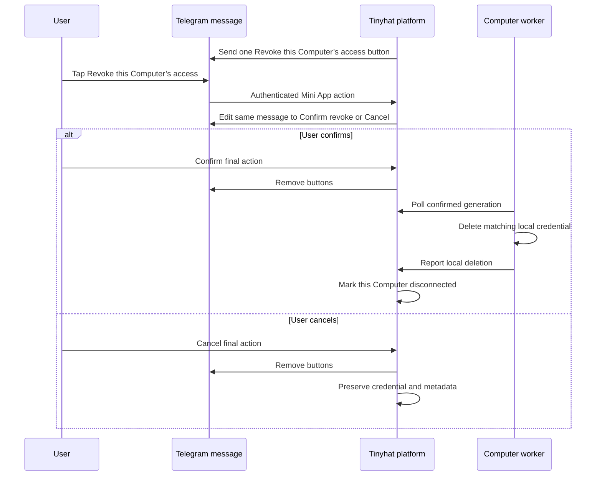

# Capabilities

The current capability list is intentionally small.

| Capability | Status | Why it exists |
| --- | --- | --- |
| `tinyhat_plugin_version` | Available now | Proves which Tinyhat plugin version Hermes has loaded for the live agent. |
| `tinyhat_tell_joke` | Available now | Proves Hermes loaded the Tinyhat plugin and can call a plugin tool. |
| `tinyhat_skill_catalog` | Available now | Lists Tinyhat plugin skills with `tinyhat:<skill>` qualified names and unqualified aliases. |
| `tinyhat_private_secret_handoff` | Available now | Lets a user enter a secret in a Telegram Mini App while Tinyhat stores only short-lived ciphertext. |
| `tinyhat_google_workspace` | Available now | Connects an existing Google Workspace account, supports a confirmed least-privilege Gmail-send upgrade, and starts the platform-authenticated local disconnect ceremony. |
| `tinyhat_google_workspace_app` | Available now | Lends assignment-verified Google access to one bounded invocation of the managed `gws` app. |
| `tinyhat_google_workspace_app_manager` | Available now | After approval, installs or removes the pinned integrity-verified `gws` app; Hermes supplies the operation skill. |
| `tinyhat-codex-auth` skill | Available now | Teaches the agent to start and inspect the Tinyhat-installed OpenAI Codex / ChatGPT subscription auth flow. |
| `tinyhat_plugin_update` | Available now | Checks and applies the configured plugin channel through installed runtime commands. |
| `pre_llm_call` context | Available now | Gives Hermes a short Tinyhat operating reminder on first turn and Tinyhat-sensitive requests. |

Each capability should be visible in this document, represented by a small
tool or skill, and covered by validation.

## Private Secret Handoff

This capability is used when the user wants to save an API key, token,
password, or credential for their agent.

The agent must not ask for the secret in chat. Instead, it calls
`tinyhat_private_secret_handoff`. The Computer creates a temporary key
pair, the Mini App encrypts the entered value with the public key, and the
Computer decrypts the submitted ciphertext with the temporary private key.
Tinyhat stores only ciphertext during the short handoff window.
After save, the worker reports the install to the platform with
`outcome="installed_restart_pending"`; the platform queues the runtime's
one-shot gateway restart and sends the final ready-or-failed confirmation
after that restart settles. The worker never restarts the gateway itself.

## Tinyhat Platform Context

The plugin injects a short context note when the user asks about secrets,
credentials, Tinyhat, Codex auth, usage limits, plugin updates, skill
lookup, QA reports, or on the first turn of a session. The context tells
the agent to prefer Tinyhat private secret entry for credentials,
Tinyhat's installed Codex commands for OpenAI Codex auth, the plugin
catalog for missing skill lookup, and runtime channel commands for stale
installed plugins. The longer playbook lives in
`skills/tinyhat-platform/SKILL.md`.

## Google Workspace

The agent calls `tinyhat_google_workspace` with `{"action": "connect"}`. The
tool sends one native Telegram inline button labeled **Connect Google**. It does
not return an `authorization_url`, and the agent must never paste or repeat a
plain link. The detached worker starts before the button is sent, so a worker
startup failure cannot leave a dead button. If Telegram delivery fails, the
plugin claims the handoff as failed and the worker cleans its one-time state.
The user signs into an existing Google account; they do not create or provide a
Google Cloud project, OAuth client, secret, or server access. The fixed first-use
connection grants identity plus read-only Gmail, Calendar, and Drive. It requests
no write scope.

The Computer creates a fresh RSA keypair for every attempt. Trusted plugin code
requests only the allowlisted `google_workspace_readonly_v1` bundle. Its
canonical services are `identity`, `gmail`, `calendar`, and `drive`; its scopes
are exactly `openid`, `email`, `profile`,
`https://www.googleapis.com/auth/gmail.readonly`,
`https://www.googleapis.com/auth/calendar.readonly`, and
`https://www.googleapis.com/auth/drive.readonly`. The tool accepts no arbitrary
scope or service input. The platform validates all three fields and returns the
Google URL authored from its central Web OAuth client.

For a connected user who asks to send Gmail or change Calendar events, the agent
first asks for explicit permission to expand the connection. Only after
confirmation does it call `tinyhat_google_workspace` with the named
`gmail_send`, `calendar_write`, or `gmail_send_calendar_write` profile. These map
to `google_workspace_gmail_send_v1`, `google_workspace_calendar_write_v1`, and
`google_workspace_gmail_send_calendar_write_v1`; they add `gmail.send`,
`calendar.events`, or both to the exact read-only baseline. They do not add
restricted `gmail.compose` or
broader Calendar settings access. The plugin verifies and retains existing
write permissions automatically when adding another permission or reconnecting,
so Calendar write cannot remove Gmail send and a default reconnect cannot
silently downgrade either permission. The existing credential remains usable
unless the new encrypted credential completes successfully and replaces it
atomically. Permission expansion is separate from confirming any outbound email
or Calendar event change. The permission-expansion button is labeled **Upgrade
Google access**, so it cannot be mistaken for first connection.

The platform owns the callback, validates state, exchanges the code, verifies
userinfo and the granted scope set, and encrypts the complete credential envelope
to the one-time Computer public key. It handles tokens transiently and retains
only short-lived ciphertext and safe handoff metadata. A detached plugin worker
polls for `ready`, decrypts the envelope, and atomically stores tokens under a
`0700` owner directory in a `0600` file. `cancelled`, `failed`, `expired`, and
`superseded` are terminal and produce fixed safe outcomes. The local credential
file is permission-protected, not application-encrypted at rest.

Only the latest active handoff may install. An owner-only active-generation
marker and exclusive lifecycle lock serialize connect, worker install, and
disconnect. Invalid or malformed owner-only credential entries are deleted under
that lock together with pending handoffs so stale tokens cannot block reconnect.
The credential also carries a Tinyhat assignment binding that is revalidated
before install, status, or later use. Assignment mismatch wipes stale local
state. `{"action": "status"}` returns only safe identity metadata.

`{"action": "disconnect"}` starts a platform-authenticated two-stage Telegram
ceremony. The tool sends the initial native `web_app` button itself and exposes
no URL, token, or intent identifier to the model. The agent does not send a
duplicate reply and never passes or claims `confirmed: true` for disconnect.

This diagram shows how one Telegram message moves from review to a terminal
choice without trusting the model to confirm deletion.

The worker is generation-bound, so a stale confirmation cannot delete a
credential installed by a later reconnect. The confirmed action removes only
this Computer's local credential and then updates its platform metadata. It
does not call Google's token-revocation endpoint or revoke the provider grant in
the shared development OAuth project. Other Tinyhat Computers remain connected.

The connection tool itself does not expose messages, events, or files, and this
authentication plugin does not implement Gmail, Calendar, or Drive operations.
Hermes's bundled `google-workspace` skill owns operation guidance and result
interpretation. Its OAuth setup and scripts are bypassed; bounded raw API argv
goes only through the generic `tinyhat_google_workspace_app` bridge.

The bridge verifies assignment and resolves only the fixed
`/opt/tinyhat/bin/gws` binary after the app manager validates its root-only
manifest against hardcoded path, mode, architecture, source, and SHA-256. It
runs with no shell, no stdin, a private ephemeral home/config/cwd, a minimal
environment, and only `GOOGLE_WORKSPACE_CLI_TOKEN` as its credential. The access
token never enters argv, output, logs, or persistent gws state. The refresh token,
client ID, client secret, credential path, inherited Google config, and
application-default credentials never enter the child.

Authentication/setup/login/export commands, persistent server mode, file-I/O
and external-sanitization flags, and `--page-all` are blocked. Legitimate Google
API methods named `export` remain available because only the top-level credential
flow is blocked. Execution time and output are bounded; timeout or overflow kills
the process group without returning partial Google data. Returned app content is
defensively redacted and marked untrusted.

When access is near expiry or gws returns its authentication exit code, the
plugin refreshes at most once through the Tinyhat platform and retries at most
once. The platform uses its central OAuth client secret and encrypts the refreshed
token envelope to a one-time Computer key; the plugin atomically updates only
token fields after assignment validation. The Computer never receives the
client secret. The user supplies no Google Cloud project, OAuth values,
credentials JSON, app password, `gcloud`, `gws auth`, or second OAuth flow.

If the managed app is absent, the agent suggests Tinyhat's
pinned Google Workspace CLI integration and asks before changing the Computer.
Only after approval may it call `tinyhat_google_workspace_app_manager` with
`{"action": "install", "confirmed": true}`. The manager supports official
Linux x86_64 and aarch64 v0.22.5 artifacts, performs bounded HTTPS downloads,
verifies hardcoded archive and extracted-binary hashes, rejects unsafe archive
paths, and installs transactionally. New installs manage only the binary and
reuse Hermes's bundled skill. A confirmed reinstall from the legacy layout
retires exact old top-level gws skills and quarantines modified copies. The
native Hermes skill and unmanaged files remain untouched. Operations use the
bridge and never `gws auth` or Hermes's local-client setup scripts.

This is a hardened tool boundary, not an operating-system privilege boundary.
Today Hermes, plugin tools, and terminal commands run as uid 0, the owner of the
`0600` local Google credential. A malicious root-running process can still read
that credential or another process's environment; future production hardening
must privilege-separate credential custody and token lending. The deterministic
write `confirmation_id` detects changed argv between confirmation steps, but it
does not prove human presence. The user's explicit current instruction or
confirmation authorizes the external write.

## Codex / ChatGPT Subscription Auth

This capability is used when the user says something like "connect you to
my ChatGPT account", "use my Codex subscription", "use my own OpenAI paid
access", or "switch from platform credits".

The agent should load `tinyhat:tinyhat-codex-auth` and call
`tinyhat_codex_auth` once with `{"action": "prerequisite"}`. The helper
sends the ChatGPT Settings > Security screenshot and puts `/codex_auth`
on its own line. The user opens `chatgpt.com` > Settings > Security,
scrolls to **Secure sign in with ChatGPT**, turns on **Enable device code
authorization for Codex**, and then taps `/codex_auth` in the same
Telegram chat. That command starts the Tinyhat-installed auth flow. The
auth flow sends an OpenAI
authorization button and a separate copyable device code to Telegram,
waits for OpenAI to complete device auth on the Computer, switches
Hermes to Codex auth, and restarts the Telegram gateway. The agent should
not send duplicate text replies, call the prerequisite action twice, or
ask for `auth.json`, refresh tokens, passwords, or OpenAI API keys for
this subscription-auth path. For follow-up inspection, the same tool
accepts `{"action": "status"}`, `{"action": "log"}`, or
`{"action": "limits"}` and returns bounded runtime output.

## Plugin Update And Skill Discovery

These capabilities are used when the live Computer is behind its configured
plugin channel or when Hermes cannot find Tinyhat plugin skills by their
unqualified names.

For skill lookup failures, the agent calls `tinyhat_skill_catalog` and
uses the returned `qualified_name` values, for example
`tinyhat:tinyhat-codex-auth`. This keeps Tinyhat plugin skills
discoverable even when a generic `skills_list` output omits
plugin-qualified entries.

For stale installed plugin reports, the agent calls
`tinyhat_plugin_update` with `{"action": "status"}` first. When the
runtime reports `update_available=true` or `decision=target_ref_changed`,
the agent applies the update only after the user/operator asks for it:
`{"action": "update", "confirmed": true, "restart_gateway": true}`. The
tool delegates to the installed runtime commands rather than composing
arbitrary shell commands in chat.

## Capability Rules

- Capabilities must have clear names.
- Skills should explain when to use a capability and what not to expose.
- Privileged work should go through Tinyhat platform APIs using the
  Computer identity provided by the runtime.
- Secrets, signed URLs, and private platform endpoints must not be
  printed into chat.
- Secret values must be entered in dedicated user-facing flows, not chat
  messages or skill instructions.
