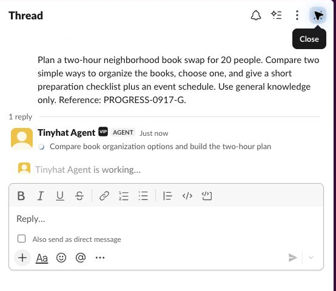
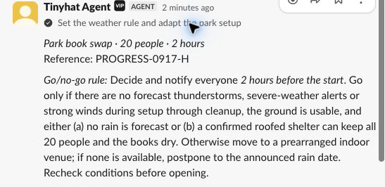
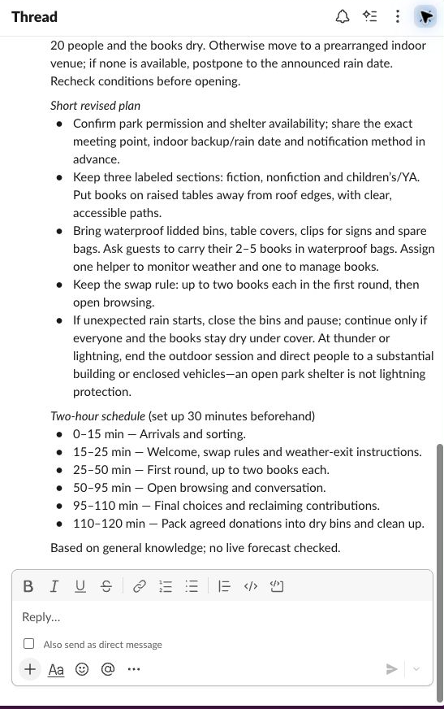
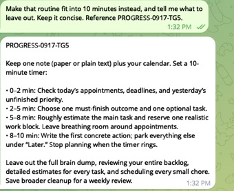

# Channel progress verification — 2026-09-17

Real incoming messages reached authenticated Codex (`gpt-6-astra`), which chose
and called the scoped channel tools. Test requests did not ask for typing,
progress, streaming, or a particular API. Screenshots are actual client captures,
cropped and redacted to omit personal identity and unrelated conversations.

## What failed and changed

- A fresh Slack task stopped at a permission request to reread the response
  skill with a shell command, despite its full text already being supplied.
  The revised skill explicitly uses that supplied text. A new Slack task and
  Telegram task subsequently completed with no command execution or pending
  approvals. Approval policy and other permission boundaries were unchanged.
- A legacy custom Slack status returned success, but the captured modern client
  still showed generic working feedback; that success did not prove visible
  custom progress. The skill now prefers native stream
  task cards to describe the first real step before work starts.
- One early Slack append failed. The agent sent a durable fallback answer in
  the same thread and stopped the stream. The provider rejection reason was
  not available from the sanitized tool error. The final instructions use
  text chunks within task streams and explicitly complete/error their cards.
  A follow-up then passed start, append, and stop with a completed task card
  and the final answer in one stream. This does not prove the earlier
  rejection's cause or guarantee provider availability.

## Slack: root request and threaded follow-up

The ordinary root request compared ways to organize a neighborhood book swap.
Before composing the answer, the agent opened the specific step
“Compare book organization options and build the two-hour plan.”

The follow-up adapted the plan for an outdoor park. It showed “Set the weather
rule and adapt the park setup,” appended its answer, and finalized the same
stream with that step marked complete. Working feedback cleared. Official
App Server thread readback confirmed successful provider receipts and no
shell commands or approval requests in the fresh task and follow-up.

## Telegram: new request and follow-up

An ordinary request compared daily-planning tools. The agent renewed typing,
sent two progressively updated drafts, then persisted the complete answer.
A concise follow-up showed typing and delivered one lasting reply. Official
thread readback confirmed successful API calls and no pending approvals.

## Limits and cleanup

Slack ran on an existing Linux Computer with the companion runtime PR #190
candidate. Telegram used an isolated local receiver and an existing development
bot. No new bots, Computers, or cloud resources were created. The Linux test
Computer was restored to its released files after all test work completed.
The local receiver was stopped, its webhook remained unchanged, and temporary
credentials were removed. This is text-feedback verification; media and Claude
Code were not retested. No release, promotion, or production rollout is claimed.
