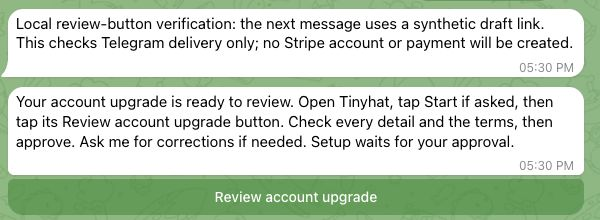

# Reviewed individual account upgrade

The assigned Computer prepares an encrypted owner-bound draft. The tool sends a
Telegram review button when available and always returns its review URL. The
button hands off to the backend-controlled Tinyhat bot when the platform supplies
`telegram_review_url`. The owner taps Start if prompted, then taps that bot's
native review Mini App button and uses Telegram sign-in. Missing or null handoffs
fall back to the standalone review page; legacy `mini_app_url` is ignored.
The owner reviews all details and the terms and approves using one checkbox and
the final approval button. Changes
invalidate earlier reviews. The tool has no consent or final approval action.

This keeps existing owner accounts and Computer credentials; it does not sign up
another user, grant spending credit, or purchase a service. Compatible platform
review APIs must deploy before this plugin is released: the decimal-id start-link
producer, platform-bot start handler and platform-only final-consent
authentication must all be verified. Existing plugins get a fresh standalone
URL because the new platform returns null for the legacy Mini App field.
No runtime or channel change is included.

Verification covers allowed actions, revision handling, removal of attested
consent, safe review URLs, Telegram message/button generation, the review URL
kept after delivery, transport errors, owner identity and package registration.
The screenshot below shows the current tool delivering an ordinary URL button
through the real Telegram Bot API with a synthetic draft. It verifies the message
and button delivery, not a complete platform-bot handoff or Stripe approval.
Full live handoff verification remains a release prerequisite.

