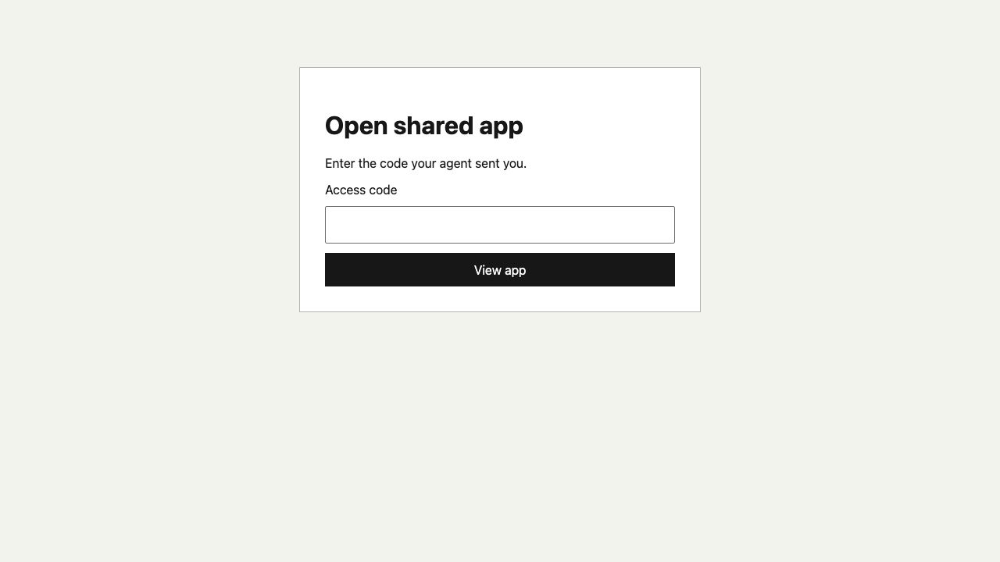

# Local app sharing verification

These screenshots are sanitized visual evidence for issue #226. They were
captured from the branch implementation with no live share identifier, access
code, Telegram chat history, or owner identity visible.

## Native Telegram action

The Agent reply includes Telegram's native Mini App button.

## Telegram loading state

While Telegram authentication is resolving, the Mini App shows only a loading
indicator.

## External browser access

Outside Telegram, the same share URL presents the numeric code gate.

## Authorized shared app

After authorization, the browser remains on the share-specific URL and renders
the Computer-local app through the viewer.

