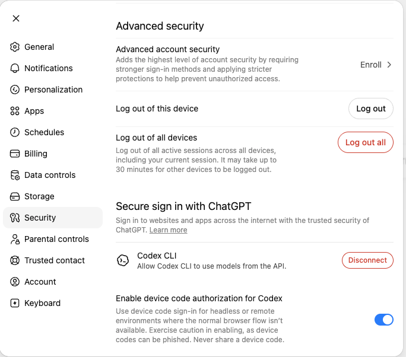

# Tinyhat Subscriptions

Use Tinyhat subscription capabilities when the user wants this Computer
to run on the **user's own ChatGPT subscription** instead of the
Tinyhat-funded platform credits, or to revert.

The user's OAuth token is **born on the Computer** (via OpenClaw's
device-code login) and never reaches the agent, the chat, or the
Tinyhat backend. The only user-facing strings during linking are the
OpenAI verification URL (`auth.openai.com`) and a short device code.

## Route User Intent

| User ask | Operation / tool |
| --- | --- |
| Connect, link, sign in with, switch to my own ChatGPT subscription / plan / Pro / Plus / Team / Business | `subscriptions.open_link` / `tinyhat_open_chatgpt_subscription_link` |
| Revert, switch back, stop using my plan, go back to Tinyhat credits / platform credits / free / funded | `subscriptions.revert_to_platform_credits` / `tinyhat_revert_to_platform_credits` |

## Prerequisite — enable device code authorization in ChatGPT

Before the user can link their subscription, **they must enable
device-code authorization in their ChatGPT security settings**. This
is OpenAI's standing requirement for headless device-code sign-in
flows; without it the linking attempt fails with a clear non-secret
error and the user has to enable the setting and retry.

When the user first asks to connect their ChatGPT subscription, walk
them through it:

1. Open [chatgpt.com → Settings → Security](https://chatgpt.com/#settings/Security).
2. Scroll to **Secure sign in with ChatGPT**.
3. Toggle on **Enable device code authorization for Codex**.
4. (Personal accounts.) The toggle is the user's to flip directly.
   (Team / Business / Enterprise.) The toggle is workspace-admin-only;
   if it's greyed out, the user has to ask the workspace admin to
   enable it. There is no way around this.

The setting is shown here (toggle highlighted blue at the bottom):

Only ask the user to confirm they've enabled it before calling
`tinyhat_open_chatgpt_subscription_link`. If they haven't, the
linking attempt will fail with a message like *"device-code login is
disabled on your ChatGPT account — see your ChatGPT security
settings to enable it"*; surface that verbatim and re-link to the
setting above.

## Link The Subscription

1. Confirm the user has enabled the device-code toggle above (one
   sentence: *"have you turned on Enable device code authorization
   for Codex in your ChatGPT security settings? If yes, I'll start
   the link."*).
2. Call `tinyhat_open_chatgpt_subscription_link`. **The tool runs
   `openclaw models auth login --provider openai-codex
   --device-code` directly on this Computer** (no backend
   round-trip), parses the verification URL + 9-character user code
   from the CLI's stdout, and returns them. The CLI subprocess keeps
   polling `auth.openai.com` in the background; when the user
   approves, OpenClaw writes the OAuth credential to its per-agent
   auth store on disk.
3. The tool result carries a Telegram inline-keyboard URL button
   pointing at `https://auth.openai.com/codex/device` plus the
   9-character code as paste-able text. Render both in the reply.
   The verification URL is the **only** raw URL allowed in chat for
   this flow — the v0.5 "no raw URLs in chat" exemption, by design.
4. Tell the user: *"open the URL on a device where you're signed in
   to ChatGPT, then paste the code. The code expires in about 15
   minutes."*
5. The Computer's supervisor detects the new auth-profile on its
   next tick and rewrites `openclaw.json` so subsequent agent turns
   route through `openai/gpt-5.5` via the native Codex runtime. The
   first agent reply after that switch confirms it — no polling,
   no separate notification flow.

## Subscription Button Contract

- Treat `text` as the user-facing copy.
- If `delivered: true` is present, the plugin has already sent the
  native Telegram URL button. Acknowledge briefly only if needed;
  do not send a duplicate button.
- Treat `channelData.telegram.buttons` as transport-only button
  data. Preserve it for Telegram rendering, but never quote or
  summarize any transport URL **other than the OpenAI verification
  URL** (the one exemption).
- The 9-character device code is the **only** paste-able non-secret
  string the user is asked to handle. Never reuse a captured code
  for a second user — codes are single-use, single-session.
- Never paste the OAuth token (the supervisor never returns it; if
  any tool result claims to carry one, treat it as a regression and
  refuse to surface it).
- If the tool returns `unsupported_channel_text`, use that copy
  when the current channel cannot render the Telegram URL button.

## Revert To Platform Credits

1. Call `tinyhat_revert_to_platform_credits`. **The tool deletes the
   `openai-codex` profile entry from this Computer's OpenClaw auth
   store directly** (no backend round-trip), then returns
   confirmation.
2. The supervisor detects the missing profile on its next tick and
   rewrites `openclaw.json` back to the OpenRouter / platform-credit
   route. The first agent turn after that switch is back on
   platform-funded credits.
3. Confirm to the user: *"done — you're now back on Tinyhat-funded
   credits. Your ChatGPT subscription is no longer linked to this
   Computer."*
4. If the user asks where the OAuth token went, explain truthfully:
   it was deleted from this Computer's local auth store; the
   platform never had it.

## Failure Messages

Surface the platform's non-secret error verbatim when it appears.
Common cases:

| Reported reason | Explain |
| --- | --- |
| `device-code login disabled on your ChatGPT account` | Walk through the security-settings prerequisite again. |
| Device code expired (15-minute window) | Offer to start a fresh link with `tinyhat_open_chatgpt_subscription_link`. |
| OpenAI provider error | Surface the message; offer a retry. |
| Network / heartbeat timeout | Tell the user the link will retry on the next supervisor tick; no action needed from them. |

Never invent a failure mode the platform did not report. If the
status surface is unavailable, say so and stop guessing.

## Do Not

- Do not ask the user for their ChatGPT password, OAuth token,
  `auth.json` contents, refresh token, API key, account id, or any
  other credential material in chat or via any tool input.
- Do not paste the OpenAI verification URL into a code block or
  raw text; render it as a Telegram URL button so the user can tap
  it directly.
- Do not share the 9-character device code across users or sessions.
- Do not link the same ChatGPT subscription to more than one
  Computer at a time (OpenAI's terms forbid account-credential
  sharing, and OpenClaw's refresh token rotates per-machine —
  sharing self-destructs technically as well as legally).
- Do not promise the user that the link survives if they recycle or
  reassign the Computer — by design, reassignment / recycling
  wipes the auth store on the Computer.
